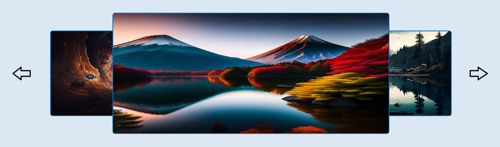

# Proven Skills Repository
This repository showcases straightforward projects, each completed in about two days, aimed at demonstrating my proficiency in specific programming languages.

Portuguese: Este repositório reúne projetos bastante simples, desenvolvidos em aproximadamente dois dias, com o objetivo de demonstrar meu domínio em determinadas linguagens.

## Project 1 "To Do List"

### Objetivo
- Criar uma lista de compromissos estilizada de uma forma girly
  
### Stack de desenvolvimento:
- HTML, CSS, JavaScript e React

## Project 2 "GitHub Finder"

### Objetivo
- Aplicação para encontrar o perfil do usuário no Github e mostrar seus seguidores, quem está seguindo, foto de perfil e seus repositórios mais importantes.

### Stack de desenvolvimento: 
- HTML, CSS e TypeScript

## Project 3 "Carrossel"

### Objetivo
- Esse projeto é um carrosel simples que permite a navegação entre diferentes slides através de botões de próximo e anterior.

### Stack de desenvolvimento: 
- HTML, CSS e JavaScript

## Project 4 "HTTP Request"

### Objetivo
- Esse projeto é um apenas um treino de requizições http usando "fetch".

### Stack de desenvolvimento: 
- HTML, CSS, React e JavaScript

## Project 5 "Forum"

### Objetivo
- Criar um Forum para adicionar e ler arquivos.

### Stack de desenvolvimento: 
- Backend: PostgreSQL e MongoDB para armazenamento de dados, JavaScript para ser a linguagem principal do backend;
- Frontend: HTML e CSS para estrutura e estilo, JavaScript e Vue.js para construção de interfaces interativas e reativas.
